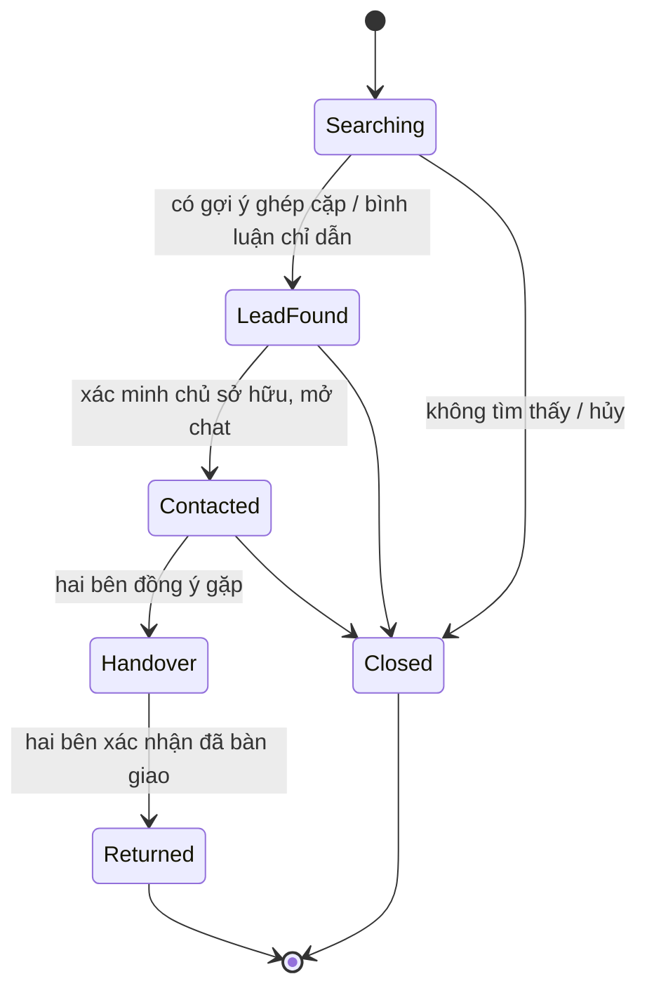

# LostLink

[English](README.md) | **Tiếng Việt**

**Nền tảng tìm đồ thất lạc dựa trên cộng đồng.**

LostLink kết nối hai nhóm người: người **làm mất** đồ và người **nhặt được** đồ. Thay vì để người dùng tự lục tìm trong hàng nghìn bài đăng, mỗi khi có bài mới hệ thống sẽ chạy bộ ghép cặp và chủ động gửi gợi ý ("Đây có phải đồ của bạn?") cho cả hai bên.

Việc ghép cặp dựa trên ba trục dữ liệu là **vị trí**, **thời gian** và **thuộc tính món đồ**, cộng thêm một lớp tin cậy cộng đồng gồm điểm uy tín, xác minh chủ sở hữu và kiểm duyệt.

## Tính năng chính

- **Bài đăng MẤT / NHẶT ĐƯỢC** với danh mục linh hoạt, thuộc tính động và hình ảnh.
- **Bộ ghép cặp hai chiều**: chấm điểm theo luật, giải thích được (không dùng ML). Các điều kiện bắt buộc về vị trí, thời gian và thuộc tính loại trừ giúp thu hẹp ứng viên; điểm mềm có trọng số (vị trí, thời gian, danh mục, mô tả, hình ảnh) dùng để xếp hạng phần còn lại.
- **Xác minh chủ sở hữu**: phải trả lời đúng câu hỏi bảo mật của người nhặt (hoặc gửi yêu cầu liên hệ) thì mới thấy thông tin liên lạc và mở được chat.
- **Chat và bàn giao**: gợi ý điểm hẹn công cộng an toàn, và hai bên cùng xác nhận "đã trả" để đóng bài đăng.
- **Uy tín và bảng xếp hạng**: điểm tin cậy và huy hiệu nhận được từ các lần bàn giao thành công và đánh giá.
- **Cảnh báo theo khu vực (geofence)**: nhận thông báo khi có bài mới trong khu vực bạn theo dõi.
- **Kiểm duyệt và chống gian lận**: báo cáo vi phạm, hàng đợi duyệt bài, chuyển cấp xử lý cho các giao dịch bị đình trệ, và email nhắc nhở tự động.

## Vòng đời bài đăng

Bài đăng đi qua một chuỗi trạng thái; mỗi lần chuyển trạng thái được ghi lại thành một mốc để dựng dòng thời gian.



| Trạng thái                         | Ý nghĩa                                                                                                          |
| ---------------------------------- | ---------------------------------------------------------------------------------------------------------------- |
| **Đang tìm** (Searching)           | Bài đăng đang hoạt động và tham gia ghép cặp.                                                                    |
| **Có manh mối** (Lead found)       | Hệ thống đã gợi ý một bài khớp, hoặc có bình luận chỉ ra món đồ.                                                 |
| **Đã liên hệ** (Contacted)         | Hai bên đã qua bước xác minh; kênh chat được mở.                                                                 |
| **Đang bàn giao** (Handover)       | Hai bên đã đồng ý gặp và đang trao đổi trực tiếp.                                                                |
| **Đã trả** (Returned) _(đóng)_     | Hai bên cùng xác nhận (hoặc hệ thống/Moderator xác nhận thay), sau đó bài đăng bị khóa và điểm uy tín được cộng. |
| **Đã đóng** (Closed) _(nhánh phụ)_ | Không tìm thấy món đồ, hoặc bài đăng bị hủy.                                                                     |

## Vai trò

Quyền được kế thừa (vai trò cao hơn có toàn bộ quyền của vai trò thấp hơn):

| Vai trò       | Phạm vi                                                                                                                            |
| ------------- | ---------------------------------------------------------------------------------------------------------------------------------- |
| **Guest**     | Xem và lọc bài đăng công khai, xem bảng xếp hạng và thống kê chung (vị trí bị làm mờ).                                             |
| **User**      | Đăng và quản lý bài, xử lý gợi ý ghép cặp, xác minh và chat, nhận đồ, bình luận, đánh giá, đặt cảnh báo khu vực, báo cáo vi phạm.  |
| **Moderator** | Duyệt bài, xử lý báo cáo, khóa tài khoản tạm thời, giải quyết các trường hợp chuyển cấp và xác nhận bàn giao thay người dùng.      |
| **Admin**     | Quản lý người dùng và vai trò, điều chỉnh ngưỡng và trọng số thuật toán, quản lý danh mục/thuộc tính, dashboard, nhật ký hệ thống. |

## Công nghệ

- **Frontend** (`frontend/`): React 19 + Vite, React Router, Tailwind CSS.
- **Backend** (`backend/`): Node.js + Express, MongoDB (Mongoose), xác thực JWT.

## Cấu trúc dự án

```
LostLink/
├─ frontend/   # Web client React + Vite
└─ backend/    # API Express + MongoDB
```

## Bắt đầu

Cần Node.js 24 và MongoDB.

```bash
# Backend
cd backend
npm install
copy .env.example .env   # (macOS/Linux: cp)
npm run seed
npm run dev

# Frontend (mở terminal mới)
cd frontend
npm install
npm run dev
```

## Tài khoản thử nghiệm

### Tài khoản theo vai trò (mỗi cấp quyền một tài khoản)

| Vai trò       | Email               | Mật khẩu    |
| ------------- | ------------------- | ----------- |
| **Admin**     | `admin@lostlink.vn` | `Admin@123` |
| **Moderator** | `mod@lostlink.vn`   | `Mod@1234`  |
| **User**      | `user@lostlink.vn`  | `User@1234` |

### Thành viên cộng đồng (tác giả các bài đăng mẫu)

Các tài khoản này khớp với tên hiển thị trong feed demo, bảng xếp hạng và trang cá nhân. Tất cả dùng chung mật khẩu **`User@1234`**.

| Tên người dùng (username) | Email                      | Uy tín |
| ------------------------- | -------------------------- | ------ |
| `minhkhoi.td`             | `minhkhoi.td@lostlink.vn`  | 312    |
| `hoangnam.q1`             | `hoangnam.q1@lostlink.vn`  | 248    |
| `baotran.sg`              | `baotran.sg@lostlink.vn`   | 174    |
| `ngockhanh.dn`            | `ngockhanh.dn@lostlink.vn` | 141    |
| `thuylinh.hn`             | `thuylinh.hn@lostlink.vn`  | 96     |
| `ducanh.bk`               | `ducanh.bk@lostlink.vn`    | 60     |
